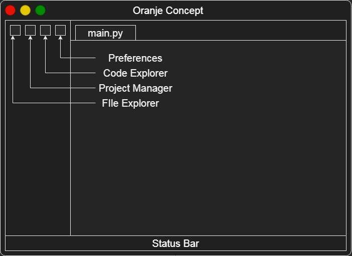

# Oranje (Dutch: Orange)
<i>\*\*I don't think I needed to tell that translation..</i>

### Oranje is a text editor that aims to be a successor to my old editor [whirlEdit](https://github.com/whmsft/whirledit) and also a Refresh of "Thee".




#### This editor aims to be highly moduler, such that

* The executable is a blank tkinter app that runs modules
* Updating and modules controlled by a cli tool (called ore)

## How To's

**Install package:**
```
# Branch name and directory are optional
python ore.py install whmsft/oranje --branch=main --dir="package/whmsft/oranje/"
```
*This installs package from github repo "whmsft/oranje" at branch main from provided folder*

## Extension System

Every Extension is a must to have this directory system:
```
plugin_name
  + __init__.py
  + data.yml
```

where `data.yml` includes information about package and what to run.

`Sample_data.yml:`
```yaml
author:
  name: whmsft
  email: whmsft@outlook.com
package:
  name: Oranje Editor
  url: https://github.com/whmsft/Oranje
  version: [0, 0, 1]
tasks:
  initialize: null # Function to run when imported
  beforeLoop: null # Function to run just before tk.mainloop()
  afterLoop : null # Function to run after tk.mainloop() (ex cleanup)
depends: []
```

The `__init__.py`, on the other hand, is loaded as a simple package, which is accessed by other modules as `package.{author}.{name}`
